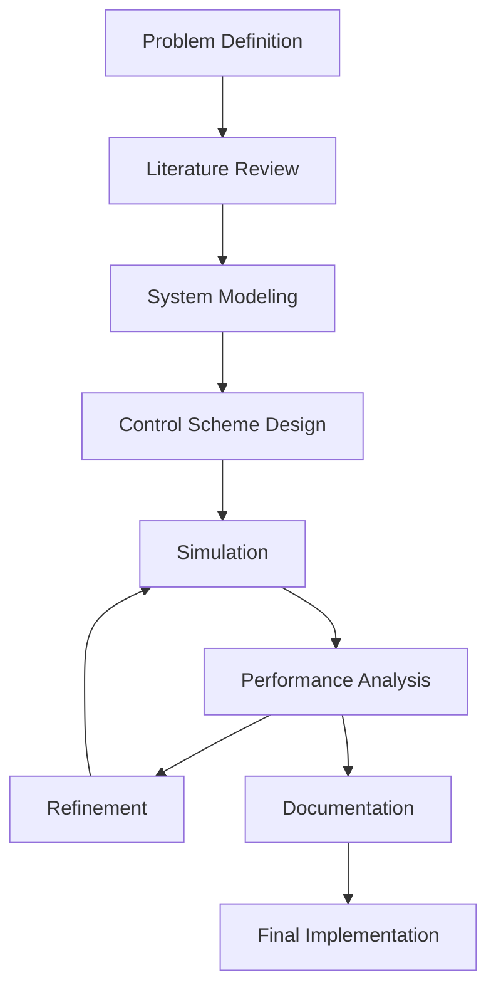

# Battery Energy Storage System (BESS) Thermal Management Control Scheme


## 📋 Project Overview

This repository contains the development of an intelligent control scheme for thermal management in Battery Energy Storage Systems (BESS). The project aims to enhance battery safety, efficiency, and lifespan through advanced thermal management techniques.

## 🔥 Problem Statement

Batteries generate heat during charging and discharging. Excessive heat can lead to reduced efficiency, accelerated aging, and even safety risks (such as thermal runaway). Managing temperature variations within the battery pack is crucial to prevent hotspots and maintain uniform conditions.

## 🎯 Objectives

The goal is to develop an intelligent control scheme that will:
- Activate cooling system based on temperature thresholds and operational parameters
- Isolate the faulted battery bank (earth fault and overcurrent conditions)
- Implement predictive thermal management to anticipate heating issues

## 🔬 Methodology

The project employs a systematic approach:

1. **Literature Review**
   - Examination of existing thermal management techniques
   - Analysis of battery thermal behavior models
   - Review of control algorithms for thermal management

2. **System Modeling**
   - Development of battery thermal models
   - Integration with electrical models
   - Simulation of various operational scenarios

3. **Control Scheme Development**
   - Design of temperature monitoring system
   - Implementation of cooling activation algorithms
   - Development of fault detection and isolation mechanisms

4. **Simulation and Testing**
   - Use of DIgSILENT/MATLAB for simulation
   - Contingency analysis for various failure modes
   - Performance evaluation under different operational conditions

## 💻 Technologies Used

- **DIgSILENT PowerFactory**: Power system simulation and modeling
- **MATLAB/Simulink**: Control system design and simulation
- **Python**: Data analysis and visualization

## 📊 Expected Outcomes

- Comprehensive BESS thermal management scheme
- Documentation of contingency analysis results
- Performance metrics for the proposed control system

## 🏭 Industry Impact

- **Safety Enhancement**: Maintaining optimal temperatures prevents thermal runaway and ensures safe battery operation
- **Extended Lifespan**: Well-managed thermal conditions contribute to a longer lifespan for BESS
- **Increased Efficiency**: Optimal temperature operation improves overall system efficiency
- **Cost Reduction**: Preventing battery damage reduces replacement and maintenance costs

## 🔄 Project Workflow



## 📁 Repository Structure

- `/docs` - Project documentation
- `/models` - Battery and thermal models
- `/simulations` - DIgSILENT and MATLAB simulation files
- `/control` - Control scheme implementation
- `/analysis` - Results and analysis

## 🚀 Getting Started

### Prerequisites

- DIgSILENT PowerFactory
- MATLAB/Simulink
- Python 3.8+

### Installation

```bash
# Clone this repository
git clone https://github.com/HorizonHnk/Battery-Energy-Storage-System-BESS-Thermal-Management-Control-Scheme.git

# Navigate to the project directory
cd Battery-Energy-Storage-System-BESS-Thermal-Management-Control-Scheme

# Install required Python packages
pip install -r requirements.txt
```

## 📈 Progress Updates

This is an ongoing project. Progress updates will be posted regularly on the project's [YouTube channel](https://www.youtube.com/playlist?list=PLrZbkNpNVSwyXihlUnWUvnU0GJUfmbTdJ).

## 📚 Resources

- [Project Presentations](https://www.youtube.com/playlist?list=PLrZbkNpNVSwyXihlUnWUvnU0GJUfmbTdJ)
- [Related Literature](./docs/literature_review.md)

## 📞 Contact

For any questions or suggestions regarding this project, please feel free to contact:

- Email: [hhnk3693@gmail.com]
- GitHub: [@HorizonHnk](https://github.com/HorizonHnk)

## 🔗 Links

These are the links for the GitHub repository and YouTube channel:
- GitHub: [https://github.com/HorizonHnk/Battery-Energy-Storage-System-BESS-Thermal-Management-Control-Scheme.git](https://github.com/HorizonHnk/Battery-Energy-Storage-System-BESS-Thermal-Management-Control-Scheme.git)
- YouTube: [https://www.youtube.com/playlist?list=PLrZbkNpNVSwyXihlUnWUvnU0GJUfmbTdJ](https://www.youtube.com/playlist?list=PLrZbkNpNVSwyXihlUnWUvnU0GJUfmbTdJ)

## 📄 License

This project is licensed under the MIT License - see the [LICENSE](LICENSE) file for details.

---
